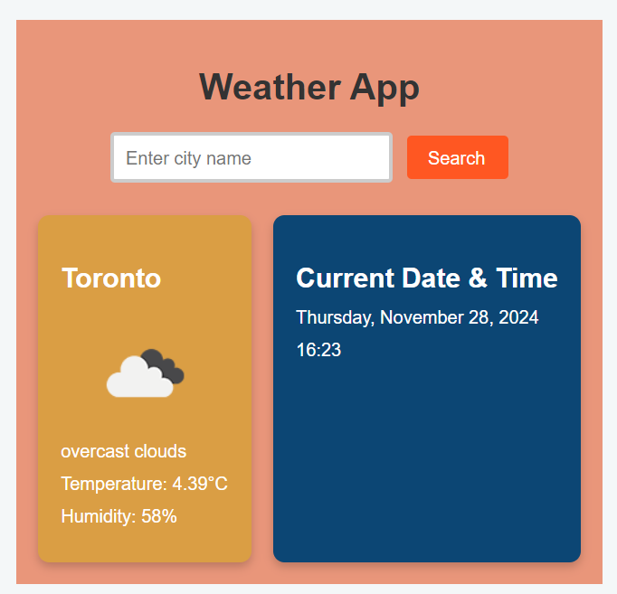
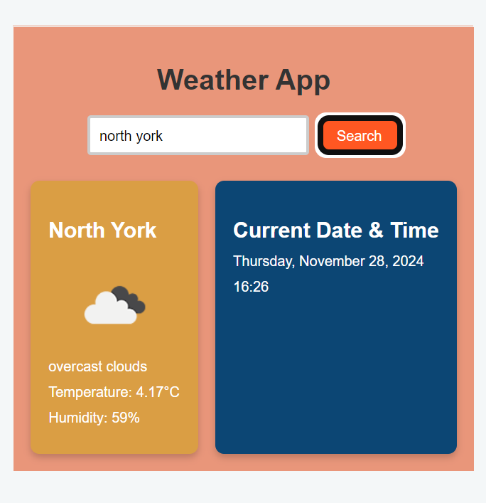
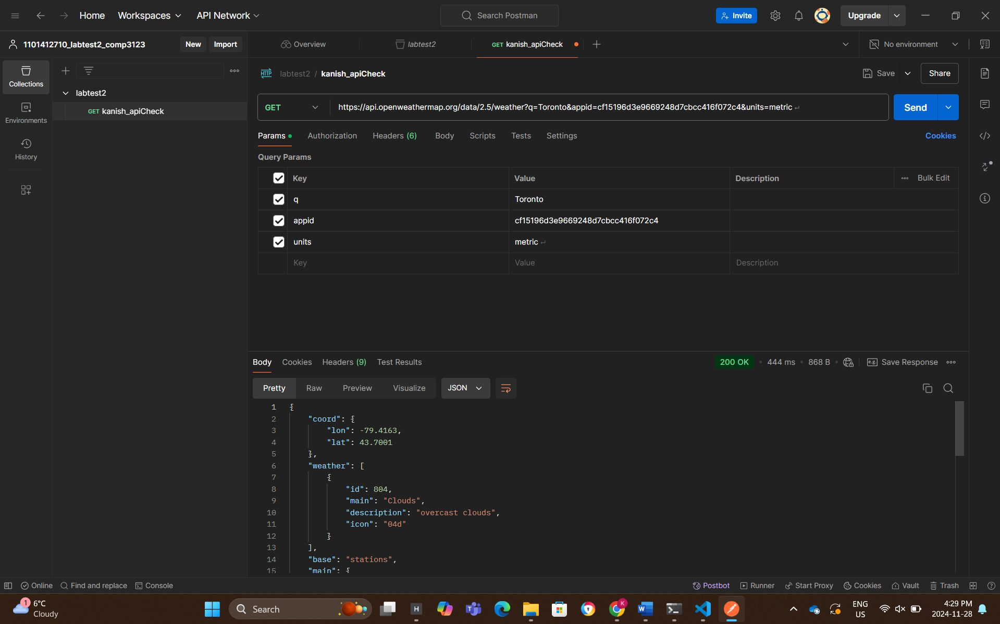

# Weather App - Kanish Hirpara (101412710)

## Features
- **Search by City**: Users can input a city name to fetch its weather data.
- **Weather Details**:
  - Current temperature
  - Weather description
  - Humidity
  - Wind speed
- **Date and Time**:
  - Displays the current date in a readable format (weekday, month, day, year).
  - Shows the current time (hours and minutes).
- **Modern Design**:
  - Two separate display boxes for weather details and date/time.
  - Vibrant green, orange, and blue themes.

---

## Technologies Used
- **Frontend**: ReactJS
- **Styling**: CSS
- **API Integration**: Axios
- **Data Source**: OpenWeatherMap API

